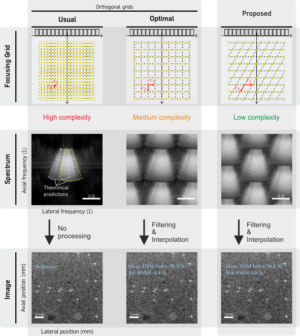

# Rhombic Grids for Coherent Plane-Wave Compounding

<!-- shields -->
[![GitHub][license-shield]][license-url]
![GitHub repository size][size-shield]
![GitHub stargazers][stars-shield]
![GitHub forks][forks-shield]<!-- [![View on File Exchange][fex-shield]][fex-url] -->
[](https://www.youtube.com/watch?v=T6dkazW5ZuM)
[![ko-fi][ko-fi-shield]][ko-fi-url]

[license-shield]: https://img.shields.io/badge/license-citationware-blue
[license-url]: https://github.com/mschiffn/rhombic_grids/blob/main/LICENSE
[size-shield]: https://img.shields.io/github/repo-size/mschiffn/rhombic_grids
[stars-shield]: https://img.shields.io/github/stars/mschiffn/rhombic_grids.svg
[forks-shield]: https://img.shields.io/github/forks/mschiffn/rhombic_grids.svg
<!--[fex-shield]: https://www.mathworks.com/matlabcentral/images/matlab-file-exchange.svg
[fex-url]: https://www.mathworks.com/matlabcentral/fileexchange/99309-frequency-dependent-f-number-for-cpwc -->
[ko-fi-shield]: https://img.shields.io/badge/ko--fi-Donate%20a%20coffee-yellowgreen
[ko-fi-url]: https://ko-fi.com/L4L7CCWYS

<!-- content -->
Simple
[MATLAB](https://mathworks.com/products/matlab.html) implementation of
the rhombic grid
[[1]](#SchiffnerIUS2022) for
coherent plane-wave compounding.



## Coming soon... stay tuned!

## Getting Started

1. Clone the repository or download the release to your local hard drive.

```
git clone https://github.com/mschiffn/rhombic_grids
```

2. Add the repository to your MATLAB path using .

```matlab
addpath( genpath( './rhombic_grids' ) )
```

## Folder Structure

The repository has the following structure:

    .
    ├── +auxiliary      # auxiliary functions (e.g., dimension and size check)
    ├── +illustration   # illustration functions (e.g., logarithmic compression)
    ├── +windows        # classes for various window functions (e.g., boxcar, Hann, Tukey)
    ├── das_pw.m        # delay-and-sum (DAS) algorithm for arbitrary grids
    ├── data_RF.mat     # measurement data from tissue phantom
    ├── example.m       # main script
    ├── LICENSE         # license file
    └── README.md       # this readme

The package +windows contains
an exemplary class hierarchy to manage
various types of
window functions.

## Image Formation

The script example.m shows the workflow to reproduce the results in
[[1]](#SchiffnerIUS2022).

## References :notebook:

1. <a name="SchiffnerIUS2022"></a>
M. F. Schiffner,
"Rhombic grids reduce the number of voxels in fast pulse-echo ultrasound imaging,"
2022 IEEE Int. Ultrasonics Symp. (IUS), Venice, Italy, Oct. 2022, pp. 1–4.
[](https://arxiv.org/abs/2210.04818)
[](https://www.youtube.com/watch?v=T6dkazW5ZuM)
